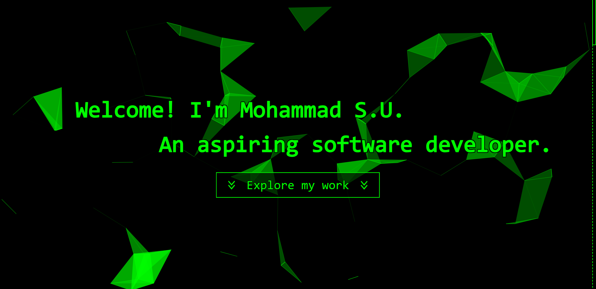
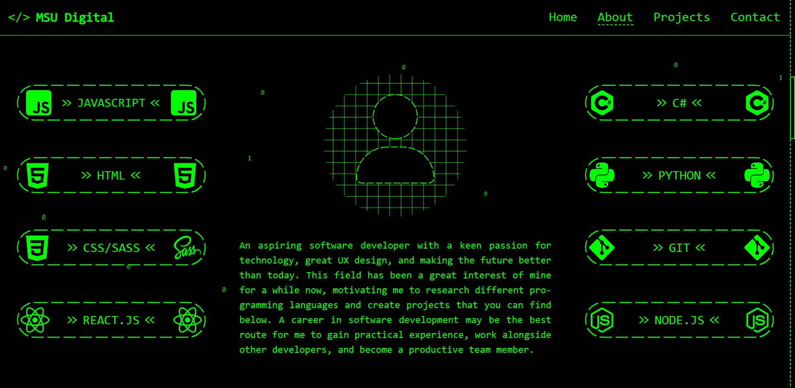
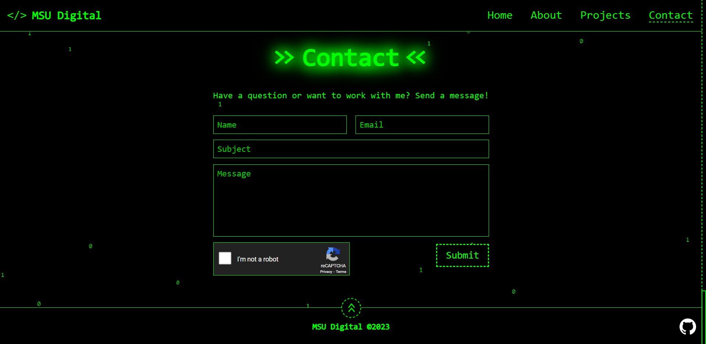

# Portfolio-MSUDigital
## My Portfolio - https://msudigital.netlify.app

### Current features:
- View information about me and my projects
- Many animations
- Responsive CSS based on window size

Attribution:
- SQL image: Edited image (coloured lime) that was made by FreePik Stockio
- Git image: Made by Jason Long - http://git-scm.com/downloads/logos, CC BY 3.0
- CSS3 and HTML images: Edited image (cropped text) that was made by Rudloff - File:CSS3 and HTML5 logos and wordmarks.svg, CC BY 3.0, https://commons.wikimedia.org/w/index.php?curid=49121103

